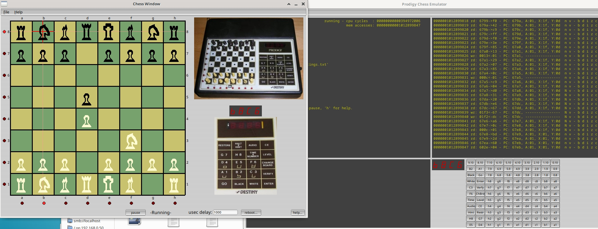

Dec-2018

This app 'emulates' the ACI Prodigy chess game hardware, the user manual avail from the net dates to 1981.

## Building
Tested with gnu gcc, for windows it compiles with msys/mingw. 
Requires FLTK libraries for linking, fltk-1.3.4-2 or better.

It also REQUIRES a rom dump file called '0x2000.bin', this can be found in a zip archive 'prodigy.zip' at your nearest MAME rom site.

Unzip the archive so '0x2000.bin' file (8KB) is in same directory as this app. 

To build, type: make

No installation is required.

If it built without error, then run: './prodigy_app' or 'prodigy_app.exe' from a folder where permissions for execution have been enabled, the app will created a 'prodigy.ini' file in same folder, this file is only used for recalling window positions.

Once running, you will see 2 windows, one with a chessboard, the other with debugging console.

On the 7 segments leds, you should see: 'L  0' on led display, click 'ENTER' button on Prodigy's panel to accept Level 0 (or pick another level between 1-8), then click on chess brd to make moves, or hit 'GO' to have Prodigy move first.

I do not own one these unit and cannot confirm the emulation operates a 100%, but have not noticed any major issues when testing functions described in the user manual.

You can increase to speed of emulation by reducing the delay 'usec delay' (delay in microseconds), hover over this control to get further tips, hit enter to make the change.

There are menus for saving and loading the current state of cpu, ram and chessboard, so you can resume a game at a later time.

## Using the debugger console
Type 'h' for help, this calls script/bat 'open_editor.sh'  or  'open_editor.bat', mod these to invoke to your text editor (make sure they have execution priveledges).

Most displayed numbers are in hex.

If you want to filter cpu writes and only see when a particular address gets written to, say 2000 Hx, type: 'fw 2000 2000'. Low range and high ranges set to the same value.

To see all writes to VIA which is at 2000Hx, type: 'fw 2000 200f', likewise read filtering can also be enabled. 
When you want to disable filtering use -1 for both ranges, e.g: 'fr -1 -1'.

To see the very first boot cpu access, hit 'p' to pause, then 'bo' for boot, then 's' for single step, the boot vector is: 60b7 Hx.

To examine memory, for example the boot vector in rom, at fffc Hx, type: 'ex ff80'.

A breakpoint can be set and execution will pause when the cpu accesses specified address, e.g. type: 'bp 79f8', this address happens to be where the interrupt vector sends the cpu, you can see this address just after the boot vector in the examine memory example above.

The console lacks a way of recalling previous commands which is a little annoying. It also only keeps a certain amount of execution history to avoid storage limitations (memory and disk).

## Development
The hardware involved was gleaned from information and PCB images kindly placed on the web, see: http://frakaday.blogspot.com, this is a blog about developing
a MAME driver for this unit.

There is a MOS 6502 processor which hails from the late 70's, its VIA a 6522, 8KB ROM, 2KB RAM, a number of common 74xxx TTL chips, leds, switches, piezo 'speaker'(by the various pitch beep sounds heard on this clip: https://www.youtube.com/watch?v=CI09gbgL6Ro ).

## Switches
The chess pieces when being placed will momentarily close switch contacts below the chessboard, likewise do the control panel buttons.  These contacts are rapidly scanned in an x,y matrix fashion. A switch would sit across one x and y row. So how do you tell which switch is pressed? - simplest way is to drive say one of x rows only and read all the y rows to see which switch is closed. A closed switch will connect its driven x row to one of the read y rows. If you look at the buttons(switches) on the debug console window, you will see the x,y coords (hover over them) and their function. Note the potential buttons without meaningful labels (those with just with x.y coords labels) are probably not wired to anything. The x coords go right to left, bit 0 is assumed to be on the right, its just the way I laid out the buttons during developement, of course when clicking on the chessboard you are in effect closing the switches in the debug console window, its not reflected on the buttons though.

To see the switch y input values being read (they appear on the VIA 8 bit ports), use the debug console and filter 2 read addresses with: fr 2000 2001. Then press one of the buttons, you'll see values change from 0xff to some other value. 0xff means the ports lines are floating high, this is what happens when no switches are closed. Note: the way I've shown x being driven and y's being read could also be the other way round, its just the way I've explained it here.

To see which x row is being driven, filter VIA out port with: fw 2000 2000 (turn off filter reads will be clearer: fr -1 -1), you will see numbers 0x09-->0x00 being written. These numbers make their way to a SN74145 chip (via copper tracks), which is a bcd to decimal decoder. If a binary nine (1001) is fed to this chip, it will pull its 'nine' output low(active low), all its other outputs will be high. You can see this if you find a datasheet of this chip, it will have a truth table. Note with the filtered writes there is also an interleved 0x05-->0x00 pattern with the 0x09-->0x00 writes. These are for led muxing, so this VIA out port is being used for both scanning switches and led muxing.

## Led Muxing
To be documented.

## Beeping
To be documented.

## Guff
The emulator is written in gnu gcc c++, it includes mos6502 code generously made avail by Gianluca Ghettini: http://github.com/gianlucag/mos6502, its been moded to include a breakpoint mechanism.

There is also a bare bones debugging console that allow observation of rom execution by the 6502 cpu, single stepping/breakpoints/address filtering/ram examine/etc. The console was very useful during the reverse engineering process, as it lets you observe memory accesses. The VIA is the main input/output path for the cpu to the rest of the circuit. So monitoring how its configured and modified revealed wiring that was not known.

The code was developed on a 32 bit PuppyLinux o/s, then moved to Ubuntu 64 bit, it has one dependency which is a lean but functional gui called FLTK. It compiles on Windows with msys/mingw and seems to run, but I was only able to test (for Windows) using VirtualBox, the double the emulation path made it very slow indeed.

Some of the code is re-purposed from other projects I've tinkered with over the years, so excuse the antiquated c style, evolving conventions and inefficiencies. The chessboard code was from a project conjured up in the previous century, I've always wanted to say that.

There are 2 threads, one for cpu emulation and and one for gui/console. In the cpu emulation thread, the ratio of processing time allocated between the 6502's non irq code and its irq code is not accurately emulated, this ratio would have had bearing on led mux strobing and switch speed scanning/debounce I'd expect.

Why do this? Well... its a reasonably complex puzzle to solve for one, particularly while not having access to a unit. I've not written an emulator before, surprisingly, emulating this hardware was not as hard as you would think, so long as your conversant with chip data sheets. The code was written intermittently over a year or so, therefore is somewhat messy - but these are the pitfalls of intermittent (lazy) coding projects... fortunately I'd included commenting breadcrumbs.

The beeping is rather poorly implemented (only 2 pitches supported), it's done by calling script/batch files for simplicity sake, in these files you could add your favourite sound commands, they must be named (linux/windows): 'beep1.sh'/'beep1.bat' and  'beep2.sh'/'beep2.bat'  (make sure they have execution priveledges). Due to the simple coding its likely not all beeps will result in calls to these script files, so some beeps may go missing.

The 'prodigy_main.cpp' file has hardware hint comments near its top. This file/code has most of the processing code:

'thrd_cpu_cb(..)' is the 6502 cpu execution thread callback
'cb_timer1(..)' is repeated called (it's called by the fltk gui thread) and is where most of console is serviced.

Hope you'll also enjoy stepping back to the cutting edge of 80's technology, and I highly recommend checking out the MAME site if you want to see some amazing preservation coding.

Some other links:

http://www.schach-computer.info/wiki/index.php/Chafitz_Destiny
http://www.spacious-mind.com/html/destiny_prodigy.html
http://alain.zanchetta.free.fr/docs/AppliedConcepts/ProdigyUS.pdf

